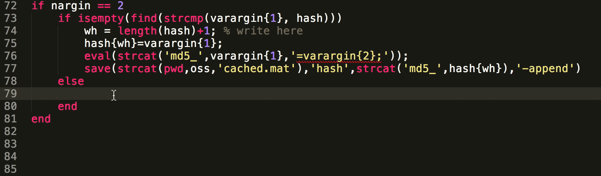

# Code

This is me writing <a href = "https://github.com/sg-s/srinivas.gs_mtools/blob/master/docs/cache.md#cachem">cache.m</a>

* [manipulate](https://github.com/sg-s/manipulate#manipulatem):
Manipulate functions and models in MATLAB

* [kontroller](https://github.com/sg-s/kontroller#kontroller):
A easy-to-use wrapper for MATLAB's DAQ toolbox

* [mtools](https://github.com/sg-s/srinivas.gs_mtools#mtools-by-srinivasgs):
A smorgasbord of various tools written in MATLAB

* [spikesort](https://github.com/sg-s/spikesort#spikesort):
Interactive, automated extracellular spike sorting for Kontroller

* [fly-voyeur](https://github.com/sg-s/fly-voyeur/wiki):
Automated fly courtship behaviour tracking and scoring

You should look at my <a href="https://github.com/sg-s/">github page</a> for other projects I'm working on.
  

All code here is [free software](http://www.fsf.org/about/what-is-free-software). You can install any of these packages directly from your MATLAB prompt using my package manager:
            
    urlwrite('http://srinivas.gs/...
        install.m','install.m'); 
    install sg-s/kontroller

# Publications

### Presynaptic GABA receptors mediate temporal contrast enhancement in *Drosophila* olfactory sensory neurons and modulate odor-driven behavioral kinetics

Davide Raccuglia, Li Yan McCurdy, Mahmut Demir, Srinivas Gorur-Shandilya, Michael Kunst, Thierry Emonet, and Michael Nitabach

[eNeuro 2016](http://eneuro.org/content/3/4/ENEURO.0080-16.2016.abstract)

### The *Drosophila* IR20a Clade of Ionotropic Receptors Are Candidate Taste and Pheromone Receptors

Tong-Wey Koh, Zhe He, Srinivas Gorur-Shandilya, Karen Menuz, Nikki K. Larter, Shannon Stewart and John R. Carlson

[Neuron 2013](http://www.sciencedirect.com/science/article/pii/S0896627314006230)

### Inferring network topology from complex dynamics

Srinivas Gorur-Shandilya and Marc Timme

[New Journal of Physics 2010](http://iopscience.iop.org/1367-2630/13/1/013004) | [direct link](assets/srinivas.gs.inferring.pdf)

### Relating Topology and Dynamics in Neuronal Networks

Srinivas Gorur-Shandilya

[M.Sc. thesis](assets/msc-short.pdf)

# Essays

* [on Books](essays/books/) 
* [on *Children of Men*](essays/children/)         
* [on Whistling](essays/whistling/) 
<!-- * [on the Importance of Secrecy](http://yaledailynews.com/blog/2014/03/28/keeping-kissinger-secret/)
* [on Aaron Swartz](http://yaledailynews.com/blog/2014/01/17/gorur-shandilya-penetrating-the-swartz-controversy/) -->

# Talks

<!-- ### [Why is anything the way it is?](why/)

Lightning talk at 30C3, Hamburg, Germany. (2013) -->

### Sequential gain control in Drosophila olfactory receptor neurons

accepted talk at [Sense2Synapse](http://sense2synapse.com/index.html) New York, USA (2016) 

### Topology Predicts Dynamics; Dynamics Constrain Topology

invited talk at [SIAM Conference on Applications of Dynamical Systems](http://www.siam.org/meetings/ds15/), Snowbird, USA. (2015)

# Photographs

<table class="center">
  <tr>
    <td width = 50%>

        
        Mukuntuweap, Utah.
    </td>
    <td width = 50%>
        
       Panchachuli, Kumaon. 
    </td>
  </tr>

  <tr>
    <td width = 50%>    
        
        Cotopaxi, Ecuador.
    
    </td>
    <td width = 50%>  
        
        Three years in Delhi, India.
    </td>
  </tr>

  <tr>
    <td width = 50%>
        
        Two years in Germany.
    </td>
    <td width = 50%>    
        
        Ladakh, India.    
    </td>
  </tr>

  <tr>
    <td width = 50%>     
        
        Pushkar, India. 
     
    </td>
    <td>    
        
        Walls.  
    </td>
  </tr>

</table>

# Contact me

You can write to &#x202E;.sg.savi&#x202D;me@srin

You should encrypt all email. Here is my [GPG public key](http://srinivas.gs/sgs.asc) which you can also get from the [MIT key server](http://pgp.mit.edu/pks/lookup?search=srinivas.gs) or on [https://keybase.io/srinivas](https://keybase.io/srinivas). Its fingerprint is 

    88C6 D016 6B09 8880 6BF8 
    F253 8C9C B698 D193 4604

You can verify this using

    curl srinivas.gs/sgs.asc |
         gpg --with-fingerprint

You can send me a encrypted message even if you don't know how to use encryption: [click here](https://hawkpost.co/box/6565b695-4f56-4a3a-9075-1b83ff19c026) to do so. 

# About this website
This page is written in [markdown](https://daringfireball.net/projects/markdown/) using [Sublime Text 3](http://www.sublimetext.com/). The markdown source is [here](./README.md) and the entire repository is available [here](https://github.com/sg-s/srinivas.gs). Most pages are rendered from markdown source. The font used here is [Goudy Bookletter 1911](https://www.theleagueofmoveabletype.com/goudy-bookletter-1911) and is in the public domain. This website is hosted on [GitHub](https://github.com/sg-s/srinivas.gs) servers.

