

	
Quotes from various people, sorted alphabetically by their last name.

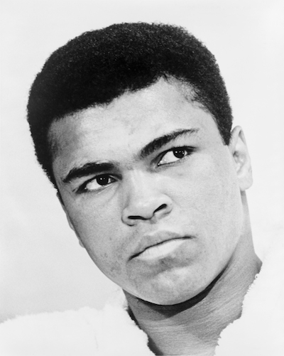</img>
  

## Muhammad Ali
[*On being drafted into the Vietnam War*](https://www.youtube.com/watch?v=HeFMyrWlZ68)
> My conscience won't let me go shoot my brother, or some darker people, or some poor hungry people in the mud for big powerful America. And shoot them for what? They never called me nigger, they never lynched me, they didn't put no dogs on me, they didn't rob me of my nationality, rape and kill my mother and father ... shoot them for what? How can I shoot them poor people? Just take me to jail.

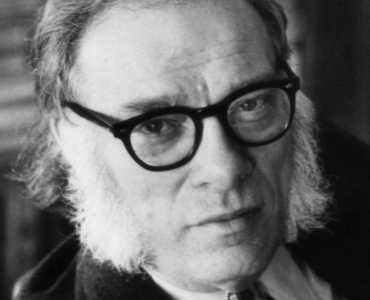</img>
  
## Isaac Asimov

A riff off Samuel Johnson's more famous comment.

[*The Foundation*](https://en.wikipedia.org/wiki/Foundation_series)
> Violence is the last refuge of the incompetent.

[*The Foundation*](https://en.wikipedia.org/wiki/Foundation_series)
> Inertia! Our ruling class knows one law; no change. Despotism! They know one rule; force. Maldistribution! They know one desire; to hold what is theirs.

[*Column in Newsweek (21 January 1980)*]()
> Anti-intellectualism has been a constant thread winding its way through our political and cultural life, nurtured by the false notion that democracy means that 'my ignorance is just as good as your knowledge'

 
 

</img>
  
## Julian Assange 

Most people don't understand how significantly technology had changed. The usually sharp Southpark completely misses the point in <a href = "http://southpark.cc.com/full-episodes/s17e01-let-go-let-gov">this</a> disaster of a episode.
  
[AMA on reddit](http://www.reddit.com/r/IAmA/comments/31om1d/we_are_julian_assange_sarah_harrison_renata_avila/cq3iqkg)
> Mass surveillance combined with mass storage means everyone is in the "watch list". Rather than a categorization problem, it's a ranking problem.

> Every day spent living your principles is a day at liberty.

[reddit AMA](http://www.reddit.com/r/IAmA/comments/28js8v/i_am_julian_assange_publisher_of_wikileaks_ask_me/ciblfvf)
> When we are aware of the world and the scale of its inhumanity and stupidity we feel small. It very hard to "think globally" and "act locally", because by thinking globally we become overwhelmed with the scale of the problems to be solved. What can ordinary people do? Support and promote projects that are acting at scale.  The clash between diversity and global uniformity which has been created by wiring the world to itself is now in play. You are the troops.

> Non-conformity is not the adoption of some pre-existing alternative subculture.

[*Conspiracies as Governance*](http://web.archive.org/web/20070829163014/http://iq.org/conspiracies.pdf)
> What advances us a civilisation is the entirety of our historical record…And if we are to make rational policy decisions, insofar as any decision can be rational, then we have to have information that is drawn from the real world, in a description of the real world. And at the moment, we are severely lacking in the information from the interior of big secretive organizations that have such a role in shaping how civilization evolves and how we all live.     
 
> Courage is not the absence of fear. Only fools have no fear. 
Rather, courage is the intellectual mastery of fear by understanding the true risks and opportunities of the situation and keeping those things in balance.

[*Conspiracies as Governance*](http://web.archive.org/web/20070829163014/http://iq.org/conspiracies.pdf)

In my opinion, this is probably one of the most important essays written in the recent past.
  
> To radically shift regime behaviour we must think clearly and boldly for if we have learned anything, it is that regimes do not want to be changed. We must think beyond those who have gone before us, and discover technological changes that embolden us with ways to act in which our forebears could not.

> Big Brother is home. He is installed in the item you just dragged home from the Apple store.

## blue_beetle 
[*user driven discontent*](http://www.metafilter.com/95152/Userdriven-discontent#3256046)
> If you are not paying for it, you're not the customer; you're the product being sold.

 
## Tony Benn
[*The Five Essential Questions of Democracy*](https://www.thenation.com/article/tony-benn-and-five-essential-questions-democracy/)

Anyone who cannot or will not answer the last question does not live in a democratic system.
 
> 1. “What power have you got?”  
2. “Where did you get it from?”  
3. “In whose interests do you use it?”  
4. “To whom are you accountable?”  
5. “How do we get rid of you?”  

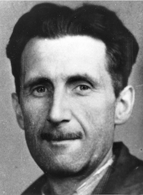</img>
 

## Eric Arthur Blair
[review published in *The New Statesman and Nation*](http://quoteinvestigator.com/2015/12/10/war-profit/)
> War against a foreign country only happens when the moneyed classes think they are going to profit from it.

[*Homage to Catalonia*](http://orwell.ru/library/novels/Homage_to_Catalonia/english/e_htc)
> All the war-propaganda, all the screaming and lies and hatred, comes invariably from people who are not fighting.

[*Nineteen Eighty-Four*](https://en.wikiquote.org/wiki/Nineteen_Eighty-Four)
> Power is not a means, it is an end. One does not establish a dictatorship in order to safeguard a revolution; one makes the revolution in order to establish the dictatorship. The object of persecution is persecution. The object of torture is torture. The object of power is power.

[*letter to Humphry House*](https://en.wikiquote.org/wiki/George_Orwell)
> There is something wrong with a regime that requires a pyramid of corpses every few years.

[*Nineteen Eighty-Four*](https://en.wikiquote.org/wiki/Nineteen_Eighty-Four)
> If you want a vision of the future, imagine a boot stamping on a human face — forever.

[*Politics and the English Language*](https://en.wikipedia.org/wiki/Politics_and_the_English_Language)
> Political language... is designed to make lies sound truthful and murder respectable, and to give an appearance of solidity to pure wind.

[*Nineteen Eighty-Four*](https://en.wikiquote.org/wiki/Nineteen_Eighty-Four)
> War is peace. Freedom is slavery. Ignorance is strength.

[*Nineteen Eighty-Four*](https://en.wikiquote.org/wiki/Nineteen_Eighty-Four)
> He who controls the past controls the future. He who controls the present controls the past.

[Review of *Power: A New Social Analysis* by Bertrand Russell](https://en.wikiquote.org/wiki/George_Orwell)
> We have now sunk to a depth at which restatement of the obvious is the first duty of intelligent men.

[*The Road to Wigan Pier*](http://www.orwell.ru/library/novels/The_Road_to_Wigan_Pier/english/e_rtwp)
> We may find in the long run that tinned food is a deadlier weapon than the machine-gun.

## William Blum
*from Killing Hope: US Military And CIA Interventions Since World War II*
> The boys of Capital, they also chortle in their martinis about the death of socialism. The word has been banned from polite conversation. And they hope no one will notice that every socialist experiment of any significance in the twentieth century — without exception — was either overthrown, invaded, corrupted, perverted, subverted, destabilized, or otherwise had life made impossible for it, by the United States and its allies. Not one socialist government or movement — from the Russian Revolution to the Sandinistas in Nicaragua, from Communist China to the FMLN in El Salvador — not one was permitted to rise or fall solely on its own merits; not one was left secure enough to drop its guard against the all-powerful enemy abroad and freely and fully relax control at home. It’s as if the Wright brothers’ first experiments with flying machines all failed because the automobile interests sabotaged each test flight. And then the good and god-fearing folk of the world looked upon these catastrophes, nodded their heads wisely, and intoned solemnly: Humankind shall never fly.

## Albert Camus
> In the midst of hate, I found there was, within me, an invincible love.
In the midst of tears, I found there was, within me, an invincible smile.
In the midst of chaos, I found there was, within me, an invincible calm.
I realized, through it all, that…
In the midst of winter, I found there was, within me, an invincible summer.
And that makes me happy. For it says that no matter how hard the world pushes against me, within me, there’s something stronger – something better, pushing right back.

> Autumn is a second spring when every leaf is a flower.

</img>
  

## Hélder Câmara 
[*Helder, the Gift: A Life that Marked the Course of the Church in Brazil*](https://en.wikipedia.org/wiki/H%C3%A9lder_C%C3%A2mara#cite_note-1)
> When I give food to the poor, they call me a saint. When I ask why they are poor, they call me a communist.

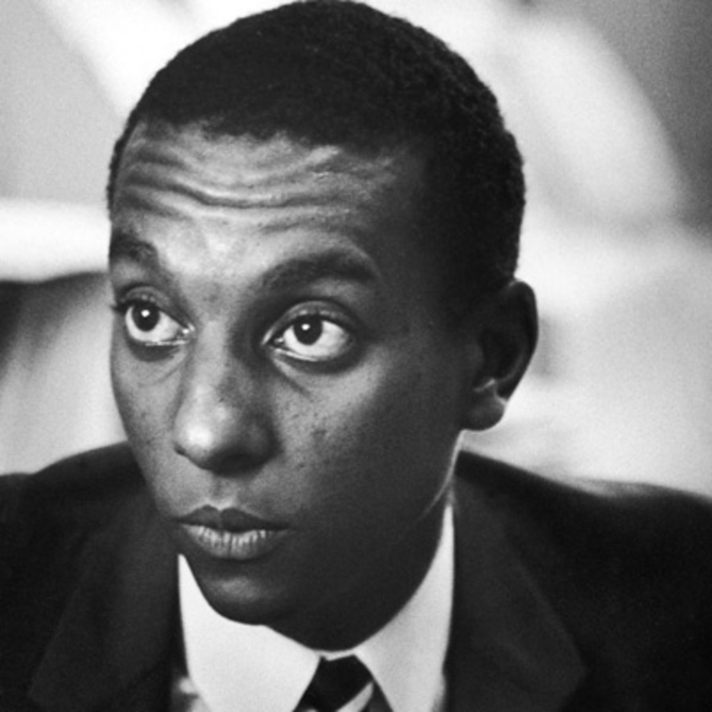</img>
 
## Stokely Carmichael (Kwame Ture) 
> I think the problem is that many people in America think that racism is an attitude. And this is encouraged by the capitalist system. So they think that what people think is what makes them a racist. Racism is not an attitude. If a white man wants to lynch me, that’s his problem. If he’s got the power to lynch me, that’s my problem. Racism is not a question of attitude; it’s a question of power.

> Racism gets its power from capitalism. Thus, if you’re anti-racist, whether you know it or not, you must be anti-capitalist. The power for racism, the power for sexism, comes from capitalism, not an attitude.

> You cannot be a racist without power. You cannot be a sexist without power. Even men who beat their wives get this power from the society which allows it, condones it, encourages it. One cannot be against racism, one cannot be against sexism, unless one is against capitalism.

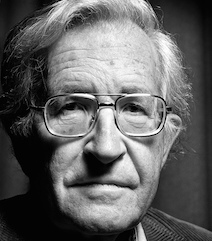</img>

## Noam Chomsky 
[On student debt and education](https://chomsky.info/20130227/)
> Students who acquire large debts putting themselves through school are unlikely to think about changing society. When you trap people in a system of debt they can't afford the time to think. Tuition fee increases are a **disciplinary technique**, and by the time students graduate, they  are not only loaded with debt, but have also internalized the disciplinarian culture. This makes them efficient components of the consumer economy. 

[*The Common Good*](https://chomsky.info/commongood01/)
> The smart way to keep people passive and obedient is to strictly limit the spectrum of acceptable opinion, but allow very lively debate within that spectrum — even encourage the more critical and dissident views. That gives people the sense that there's free thinking going on, while all the time the presuppositions of the system are being reinforced by the limits put on the range of the debate.

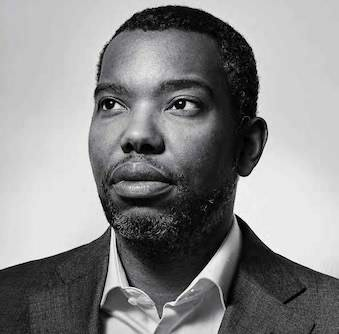</img>

## Ta-Nehisi Coates 
[*The Case for Reparations*](http://www.theatlantic.com/features/archive/2014/05/the-case-for-reparations/361631/)
> Indeed, in America there is a strange and powerful belief that if you stab a black person 10 times, the bleeding stops and the healing begins the moment the assailant drops the knife.

[*The Case for Reparations*](http://www.theatlantic.com/features/archive/2014/05/the-case-for-reparations/361631/)
> Planter: “You lazy nigger, I am losing a whole day’s labor by you.”  
Freedman: “Massa, how many days’ labor have I lost by you?”

[*The Case for Reparations*](http://www.theatlantic.com/features/archive/2014/05/the-case-for-reparations/361631/)
> Here we find the roots of American wealth and democracy—in the for-profit destruction of the most important asset available to any people, the family. The destruction was not incidental to America’s rise; it facilitated that rise. By erecting a slave society, America created the economic foundation for its great experiment in democracy...America’s indispensable working class existed as property beyond the realm of politics, leaving white Americans free to trumpet their love of freedom and democratic values. 

[*The Case for Reparations*](http://www.theatlantic.com/features/archive/2014/05/the-case-for-reparations/361631/)
> In Cold War America, homeownership was seen as a means of instilling patriotism, and as a civilizing and anti-radical force. “No man who owns his own house and lot can be a Communist,” claimed William Levitt, who pioneered the modern suburb with the development of the various Levittowns, his famous planned communities. “He has too much to do.”

[*The Case for Reparations*](http://www.theatlantic.com/features/archive/2014/05/the-case-for-reparations/361631/)
> The early American economy was built on slave labor. The Capitol and the White House were built by slaves. President James K. Polk traded slaves from the Oval Office. The laments about “black pathology,” the criticism of black family structures by pundits and intellectuals, ring hollow in a country whose existence was predicated on the torture of black fathers, on the rape of black mothers, on the sale of black children. An honest assessment of America’s relationship to the black family reveals the country to be not its nurturer but its destroyer.

[*The Beautiful Struggle*](https://en.wikipedia.org/wiki/Ta-Nehisi_Coates#The_Beautiful_Struggle)
> Nowadays, I cut on the tube and see the dumbfounded looks, when over some minor violation of name and respect, a black boy is found leaking on the streets. The anchors shake their heads. The activists give their stupid speeches, praising mythical days when all disputes were handled down at Ray's Gym. Politicians step up to the mic, claim the young have gone mad, their brains infected, and turned superpredator. Fuck you all who've ever spoken so foolishly, who've opened your mouths like we don't know what this is. We have read the books you own, the scorecards you keep—done the math and emerged prophetic. We know how we will die—with cousins in double murder suicides, in wars that are mere theory to you, convalescing in hospitals, slowly choked out by angina and cholesterol. We are the walking lowest rung, and all that stands between us and beast, between us and the local zoo, is respect, the respect you take as natural as sugar and shit. We know what we are, that we walk like we are not long for this world, and that this world has never longed for us. 

[*The Case for Reparations*](http://www.theatlantic.com/features/archive/2014/05/the-case-for-reparations/361631/)
> Chicago, like the country at large, embraced policies that placed black America’s most energetic, ambitious, and thrifty countrymen beyond the pale of society and marked them as rightful targets for legal theft. 

[*The Case for Reparations*](http://www.theatlantic.com/features/archive/2014/05/the-case-for-reparations/361631/)
> Black nationalists have always perceived something unmentionable about America that integrationists dare not acknowledge—that white supremacy is not merely the work of hotheaded demagogues, or a matter of false consciousness, but a force so fundamental to America that it is difficult to imagine the country without it.

</img>
  

## Rachel Corrie 
[last letter to her parents](http://www.theguardian.com/world/2003/mar/18/usa.israel)

<a href = "https://en.wikipedia.org/wiki/Rachel_Corrie">This</a> is what happened to her, and <a href = "https://en.wikipedia.org/wiki/Gaza_flotilla_raid">this</a> is what happened to a ship named after her delivering humanitarian supplies.
 

> Just want to write to my Mom and tell her that I'm witnessing this chronic, insidious genocide and I'm really scared, and questioning my fundamental belief in the goodness of human nature. This has to stop. I think it is a good idea for us all to drop everything and devote our lives to making this stop. I don't think it's an extremist thing to do anymore. I still really want to dance around to Pat Benatar and have boyfriends and make comics for my coworkers. But I also want this to stop. Disbelief and horror is what I feel. Disappointment. I am disappointed that this is the base reality of our world and that we, in fact, participate in it. This is not at all what I asked for when I came into this world. This is not at all what the people here asked for when they came into this world. This is not the world you and Dad wanted me to come into when you decided to have me. This is not what I meant when I looked at Capital Lake and said: "This is the wide world and I'm coming to it." I did not mean that I was coming into a world where I could live a comfortable life and possibly, with no effort at all, exist in complete unawareness of my participation in genocide. More big explosions somewhere in the distance outside.

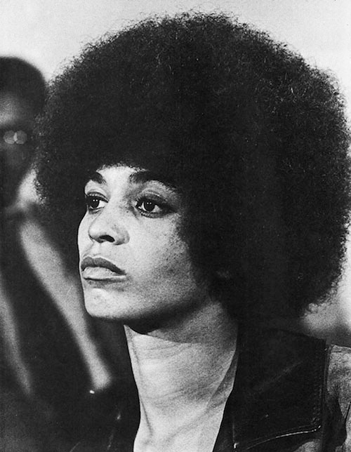</img>

## Angela Davis
> The food we eat masks so much cruelty. The fact that we can sit down and eat a piece of chicken without thinking about the horrendous conditions under which chickens are industrially bred in this country is a sign of the dangers of capitalism, how capitalism has colonized our minds.

 
 

</img>
 

## Richard Dawkins

This passage also makes an appearance on the bunny-metal band Fall of Efrafa's <a href ="https://www.youtube.com/watch?v=5Qij03PwXhw">last track</a>. 

[*The virus of faith*](https://www.youtube.com/watch?v=aMUG6qd98wc)
> There is no all seeing, all loving God who keeps us free from harm. Atheism is not a recipe for despair. I think the opposite. By disclaiming the idea of the next life we can take more excitement in this one. The here and now is not something to be endured before eternal bliss or damnation. The here and now is all we have, an inspiration to make the most of it. So atheism is life-affirming in a way that religion can never be. 
> 
> Look around you, nature demands our attention. It begs us to explore, to question. Religion can only provide us facile, ultimately unsatisfying answers. Science, in constantly seeking real explanations reveals the true majesty of our world in all its complexity. 
>  
>  
> People sometimes say, there must be more than just this world, than just this life, but how much more do you want? *We are going to die, and that makes us the lucky ones.*
>  
>  
> Most people are never going to die because they are never going to be born. The potential people who could have been here in my place but who will in fact never see the light of day outnumber the sand grains of Arabia. Certainly those unborn ghosts include greater poets than Keats, scientists greater than Newton. We know this because the set of possible people allowed by our DNA so massively exceeds the set of actual people. In the teeth of these stupefying odds it is you and I, in our ordinariness, that are here.We privileged few, who won the lottery of birth against all odds, how dare we whine at our inevitable return to that prior state from which the vast majority have never stirred?

I first heard this on <a href = "https://en.wikipedia.org/wiki/Fall_of_Efrafa">Fall of Efrafa</a>'s <a href = "https://www.youtube.com/watch?v=CqCi-x87ec0">Dominion Theology</a>. 

*The God Delusion*
> The God of the Old Testament is arguably the most unpleasant character in all fiction: jealous and proud of it; a petty, unjust, unforgiving control-freak; a vindictive, bloodthirsty ethnic cleanser; a misogynistic, homophobic, racist, infanticidal, genocidal, filicidal, pestilential, megalomaniacal, sadomasochistic, capriciously malevolent bully.

[*The Devil's Chaplain*](https://en.wikipedia.org/wiki/A_Devil%27s_Chaplain)
> There is more than just grandeur in this view of life, bleak and cold it may seem from under the security blanket of ignorance. There is deep refreshment to be had from standing up full-face into the keen wind of understanding. 

## Eugene Debs
[Statement to the Court Upon Being Convicted of Violating the Sedition Act](https://www.marxists.org/archive/debs/works/1918/court.htm)
> Years ago I recognized my kinship with all living beings, and I made up my mind that I was not one bit better than the meanest on earth. I said then, and I say now, that while there is a lower class, I am in it, and while there is a criminal element I am of it, and while there is a soul in prison, I am not free. 

## Eugene Debs
[Speech in Canton, Ohio](https://inthesetimes.com/article/22446/Bernie-Sanders-movement-socialism-legacy-DSA-political-revolution)
> I have regretted a thousand times that I can do so little for the movement that has done so much for me. The little that I am, the little that I am hoping to be, I owe to the Socialist movement. It has given me my ideas and ideals; my principles and convictions, and I would not exchange one of them for all of Rockefeller’s bloodstained dollars.
> 
> It has taught me how to serve—a lesson to me of priceless value. It has taught me the ecstasy in the handclasp of a comrade. It has enabled me to hold high communion with you, and made it possible for me to take my place side by side with you in the great struggle for the better day; to multiply myself over and over again, to thrill with a fresh-born manhood; to feel life truly worthwhile; to open new avenues of vision; to spread out glorious vistas; to know that I am kin to all that throbs; to be class-conscious, and to realize that, regardless of nationality, race, creed, color or sex, every man, every woman who toils, who renders useful service, every member of the working class without an exception, is my comrade, my brother and sister—and that to serve them and their cause is the highest duty of my life.

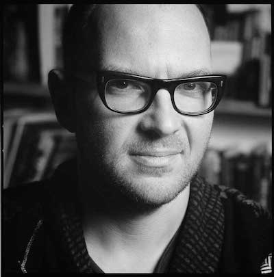</img>
 

## Cory Doctrow 
[*Doctrow's First Law*](https://www.publishersweekly.com/pw/by-topic/columns-and-blogs/cory-doctorow/article/44012-doctorow-s-first-law.html)
> Any time someone puts a lock on something that belongs to you and won't give you the key, that lock isn't there for your benefit. 

 
 

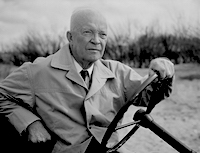</img>
 

## Dwight D Eisenhower 
[*Chance for Peace* speech](http://www.washingtonpost.com/wp-dyn/content/article/2011/01/14/AR2011011404915.html)
> Every gun that is made, every warship launched, every rocket fired signifies, in the final sense, a theft from those who hunger and are not fed, those who are cold and are not clothed.
This world in arms is not spending money alone. It is spending the sweat of its laborers, the genius of its scientists, the hopes of its children. The cost of one modern heavy bomber is this: a modern brick school in more than 30 cities. It is two electric power plants, each serving a town of 60,000 population. It is two fine, fully equipped hospitals. It is some fifty miles of concrete pavement. We pay for a single fighter with a half-million bushels of wheat. We pay for a single destroyer with new homes that could have housed more than 8,000 people. . . . This is not a way of life at all, in any true sense. Under the cloud of threatening war, it is humanity hanging from a cross of iron.

## John Ehrlichman 
[interview with Harpers](https://en.wikipedia.org/wiki/John_Ehrlichman#War_on_drugs)
> The Nixon campaign in 1968, and the Nixon White House after that, had two enemies: the antiwar left and black people. You understand what I’m saying? We knew we couldn’t make it illegal to be either against the war or black, but by getting the public to associate the hippies with marijuana and blacks with heroin, and then criminalizing both heavily, we could disrupt those communities. We could arrest their leaders, raid their homes, break up their meetings, and vilify them night after night on the evening news. Did we know we were lying about the drugs? Of course we did. 

## E M Forster
[A room with a view](https://en.wikipedia.org/wiki/A_Room_with_a_View)
> Mistrust all enterprises that require new clothes. 

## Anatole France
> The law, in its majestic equality, forbids the rich as well as the poor to sleep under bridges, to beg in the streets, and to steal bread.

## Emma Goldman
> If voting changed anything, they'd make it illegal.

## Hermann Göring 
[statement at the Nuremberg trials](http://www.snopes.com/quotes/goering.asp)
> Naturally the common people don't want war: Neither in Russia, nor in England, nor for that matter in Germany. That is understood. But, after all, it is the leaders of the country who determine the policy and it is always a simple matter to drag the people along, whether it is a democracy, or a fascist dictatorship, or a parliament, or a communist dictatorship. Voice or no voice, the people can always be brought to the bidding of the leaders. That is easy. *All you have to do is tell them they are being attacked, and denounce the peacemakers for lack of patriotism and exposing the country to danger. It works the same in any country.*

</img>
 

## Graham Greene 
*The Quiet American*
> Sooner or later...one has to take sides – if one is to remain human. 

 
 

</img>
 

## Vasily Semyonovich Grossman 
> It is only [in Stalingrad] that people know what a kilometre is. A kilometre is one thousand metres. It is one hundred thousand centimetres. 

 
 

## Bill Haywood
> The mine owners did not find the gold, they did not mine the gold, they did not mill the gold, but by some weird alchemy all the gold belonged to them!

> I've never read Marx's Kapital, but I have the marks of capital all over my body. 

## Robert Heinlein
[*Time Enough for Love*](https://en.wikipedia.org/wiki/Competent_man)
> A human being should be able to change a diaper, plan an invasion, butcher a hog, conn a ship, design a building, write a sonnet, balance accounts, build a wall, set a bone, comfort the dying, take orders, give orders, cooperate, act alone, solve equations, analyse a new problem, pitch manure, program a computer, cook a tasty meal, fight efficiently, die gallantly. Specialization is for insects.

## Eric Hughes
[*The Cypherpunk manifesto*](http://www.activism.net/cypherpunk/manifesto.html)
> Cypherpunks write code.

## Victor Hugo
> The paradise of the rich is made out of the hell of the poor. 

 
 
 

</img>
 

## Aldous Huxley
[*Island*](https://en.wikipedia.org/wiki/Island_(Huxley_novel))

> ‎"Look closely", Dr Robert insisted. Look still more closely". Then after a long minute of silence, "Dancing in all the worlds at once. In all the worlds. And first of all in the world of matter. Look at the great round halo, fringed with the symbols of fire, within which Shiva dances. It stands for Nature, for the world of mass and energy. Within it Nataraja dances the dance of endless becoming and passing away. It's his lila, his cosmic play. Playing for the sake of playing, like a child. But this child is the Order of Things. His toys are galaxies, his playground infinite space and between finger and finger every interval is a thousand million light years. Look at him there on the altar. The image is man-made, a little thing of copper only four feet high. But Shiva/Nataraja spans the universe, is the Universe. Shut your eyes and see him towering into the night, follow the boundless stretch of those arms, and the wild hair infinitely flying. Nataraja at play among the stars and in the atoms. But also, also at play within every living thing, every sentient creature, every child and man and woman. Play for play's sake. But now the playground is conscious, the dance-floor capable of suffering. To us, this play without purpose seems a kind of insult. What we would really like is a God who never destroys what he has created. Or, if there must be pain and suffering, let them be meted out by a God of righteousness, who will punish the wicked and reward the good with everlasting happiness. But in fact the good get hurt, the innocent suffer. Then let there be a God who sympathises and brings comfort. But Nataraja only dances. His play is a play impartially of life and of death, of all the evils as well as all the goods...
>  
>  
> He dances this way-what happiness! Dances that way-and oh, the pain, the hideous fear, the desolation! Then hop, skip and jump. Hope into perfect health. Skip into cancer and senility. Jump out of the fullness of life into nothingness and out of nothingness back into life. For Nataraja it's all play, and the play is an end in itself, everlastingly purposeless. He dances because he dances, and the dancing his his maha sukha, his infinite and eternal bliss.

## Fredric Jameson
> It's easier to imagine the end of the world than to imagine the end of capitalism. 

## Steve Jobs
[quoted in *The guts of a new machine*](http://www.nytimes.com/2003/11/30/magazine/the-guts-of-a-new-machine.html)
> Design is not just what it looks like and feels like. Design is how it works.

[interview with *Wired*](http://archive.wired.com/wired/archive/4.02/jobs_pr.html)
> When you're young, you look at television and think, There's a conspiracy. The networks have conspired to dumb us down. But when you get a little older, you realize that's not true. The networks are in business to give people exactly what they want. That's a far more depressing thought. Conspiracy is optimistic! You can shoot the bastards! We can have a revolution! But the networks are really in business to give people what they want. It's the truth. 

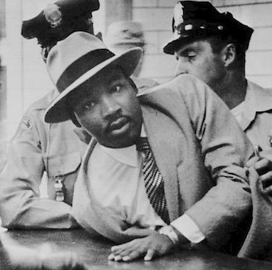</img>
 

## Martin Luther King
[*Beyond Vietnam — a Time to Break Silence*](http://www.americanrhetoric.com/speeches/mlkatimetobreaksilence.htm)
> This way of settling differences is not just. This business of burning human beings with napalm, of filling our nation's homes with orphans and widows, of injecting poisonous drugs of hate into the veins of peoples normally humane, of sending men home from dark and bloody battlefields physically handicapped and psychologically deranged, cannot be reconciled with wisdom, justice, and love.

[*Letter from a Birmingham Jail*](https://www.africa.upenn.edu/Articles_Gen/Letter_Birmingham.html)
> Actually, time itself is neutral; it can be used either destructively or constructively. More and more I feel that the people of ill will have used time much more effectively than have the people of good will. We will have to repent in this generation not merely for the hateful words and actions of the bad people but for the appalling silence of the good people. Human progress never rolls in on wheels of inevitability. 

[*Letter from a Birmingham Jail*](https://www.africa.upenn.edu/Articles_Gen/Letter_Birmingham.html)
> I must confess that over the past few years I have been gravely disappointed with the white moderate. I have almost reached the regrettable conclusion that the Negro's great stumbling block in his stride toward freedom is not the White Citizen's Counciler or the Ku Klux Klanner, but the white moderate, who is more devoted to "order" than to justice; who prefers a negative peace which is the absence of tension to a positive peace which is the presence of justice; who constantly says: "I agree with you in the goal you seek, but I cannot agree with your methods of direct action"; who paternalistically believes he can set the timetable for another man's freedom; who lives by a mythical concept of time and who constantly advises the Negro to wait for a "more convenient season." Shallow understanding from people of good will is more frustrating than absolute misunderstanding from people of ill will. Lukewarm acceptance is much more bewildering than outright rejection.

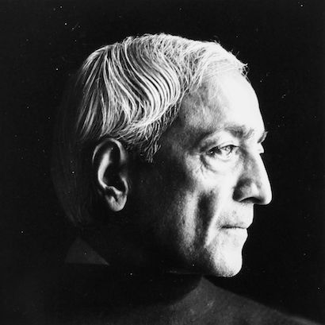</img>
 

## Jiddu Krishnamurthi
[*Freedom from the known (Chapter 6)*](http://www.jkrishnamurti.org/krishnamurti-teachings/print.php?tid=48&chid=56789)
>  When you call yourself an Indian or a Muslim or a Christian or a European, or anything else, you are being violent. Do you see why it is violent? Because you are separating yourself from the rest of mankind. When you separate yourself by belief, by nationality, by tradition, it breeds violence. So a man who is seeking to understand violence does not belong to any country, to any religion, to any political party or partial system; he is concerned with the total understanding of mankind.

## Rosa Luxemborg
> Those who do not move do not notice their chains.

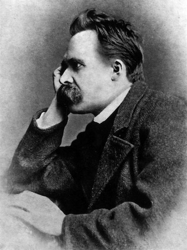</img>
 

## Friedrich Nietzsche 
letter to Elisabeth Nietzsche
> Every true faith is infallible. It performs what the believing person hopes to find in it. But it does not offer the least support for the establishing of an objective truth. Here the ways of men divide. If you want to achieve peace of mind and happiness, have faith. If you want to be a disciple of truth, then search.

## Michael Parenti
> It is the heart of U.S. policy, ladies and gentlemen, to use fascism to preserve capitalism while claiming to be saving democracy from communism.

## Terry Pratchett
Men at Arms: The Play
> Take boots, for example. He earned thirty-eight dollars a month plus allowances. A really good pair of leather boots cost fifty dollars. But an affordable pair of boots, which were sort of OK for a season or two and then leaked like hell when the cardboard gave out, cost about ten dollars. Those were the kind of boots Vimes always bought, and wore until the soles were so thin that he could tell where he was in Ankh-Morpork on a foggy night by the feel of the cobbles.
>
> But the thing was that good boots lasted for years and years. A man who could afford fifty dollars had a pair of boots that'd still be keeping his feet dry in ten years' time, while the poor man who could only afford cheap boots would have spent a hundred dollars on boots in the same time and would **still have wet feet**.

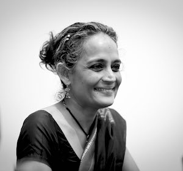</img>
 

## Arundhati Roy
*The Checkbook and the Cruise Missile*
> Sometimes I think the world is divided into those who have a comfortable relationship with power and those who have a naturally adversarial relationship with power. 

</img>
  

## Edward Said 
[*The Reith Lectures: Speaking Truth To Power*](http://www.independent.co.uk/life-style/the-reith-lectures-speaking-truth-to-power-in-his-penultimate-reith-lecture-edward-said-considers-the-basic-question-for-the-intellectual-how-does-one-speak-the-truth-this-is-an-edited-text-of-last-nights-radio-4-broadcast-1486359.html)

Similar to Chomsky's point in <a href = #chomsky-quote>this</a> quote.

> Nothing in my view is more reprehensible than those habits of mind in the intellectual that induce avoidance, that characteristic turning away from a difficult and principled position which you know to be the right one, but which you decide not to take. You do not want to appear too political; you are afraid of seeming controversial; you need the approval of a boss or an authority figure; you want to keep a reputation for being balanced, objective, moderate; your hope is to be asked back, to consult, to be on a board or prestigious committee, and so, to remain within the responsible mainstream; someday you hope to get an honorary degree, a big prize, perhaps even an ambassadorship. For an intellectual these habits of mind are corrupting par excellence. If anything can denature, neutralise and finally kill a passionate intellectual life, it is these considerations, internalised and so to speak in the driver's seat.

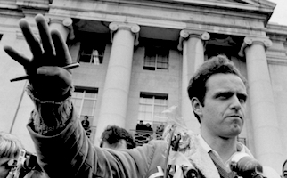</img>
  

## Mario Savio
[speech on Dec 2 1964](https://en.wikipedia.org/wiki/Mario_Savio#.22Bodies_upon_the_gears.22_speech)
> There's a time when the operation of the machine becomes so odious, makes you so sick at heart, that you can't take part! You can't even passively take part! And you've got to put your bodies upon the gears and upon the wheels…upon the levers, upon all the apparatus, and you've got to make it stop! And you've got to indicate to the people who run it, to the people who own it, that unless you're free, the machine will be prevented from working at all!

## Upton Sinclair
*The Brass Check: A Study of American Journalism*
> Some are dishonest, and some are more dishonest; some are capitalistic, and some are more capitalistic. But great as are the differences between them, and clever as are the pretenses of some of them, there is no one which does not serve vested wealth, which has not for its ultimate aim the protection of economic privilege. The great stream of capitalist prosperity may flow irregularly, it may have eddies and counter-currents, stagnant places which deceive you for a while; but if you study this great stream long enough, you find that it all moves in one direction, and that everything upon its surface moves with it. A capitalist newspaper may espouse this cause or that, it may make this pretense or that, but sooner or later you realize that a capitalist newspaper lives by the capitalist system, it fights for that system, and in the nature of the case cannot do otherwise. Some one has said that to talk of regulating capital is to talk of moralizing a tiger; I would say that to expect justice and truth-telling of a capitalist newspaper is to expect asceticism at a cannibal feast. 

</img>
  

## Edward Snowden 

There are echoes of Martin Niemöller's <a href = "https://en.wikipedia.org/wiki/First_they_came_...">words</a> here.

[AMA on reddit](http://www.reddit.com/r/IAmA/comments/36ru89/just_days_left_to_kill_mass_surveillance_under/crglgh2)
> Arguing that you don't care about the right to privacy because you have nothing to hide is no different than saying you don't care about free speech because you have nothing to say. *A free press benefits more than just those who read the paper*.

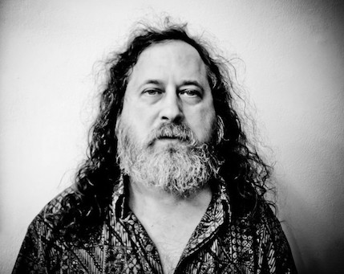</img>
  

## Richard Stallman
[*Slashdot interview 2000*](https://stallman.org/sayings.html)
> Injustice is happening now; suffering is happening now. We have choices to make now. To insist on absolute certainty before starting to apply ethics to life decisions is a way of choosing to be amoral.

[*Stallman's Law*](https://www.gnu.org/philosophy/stallmans-law.en.html)
> While corporations dominate society and write the laws, each advance in technology is an opening for them to further restrict its users.

[*Interview with OUGH!*](https://www.gnu.org/philosophy/ough-interview.en.html)
> With software there are only two possibilites: either the users control the programme or the programme controls the users. If the programme controls the users, and the developer controls the programme, then the programme is an instrument of unjust power. 

## John Steinbeck
[The grapes of wrath](https://en.wikipedia.org/wiki/The_Grapes_of_Wrath)
> There is a crime here that goes beyond denunciation. There is a sorrow here that weeping cannot symbolize. There is a failure here that topples all our success. The fertile earth, the straight tree rows, the sturdy trunks, and the ripe fruit. And children dying of pellagra must die because a profit cannot be taken from an orange. And coroners must fill in the certificates—died of malnutrition—because the food must rot, must be forced to rot.

## Matt Taibbi
[*America Is Too Dumb for TV News*](http://www.rollingstone.com/politics/news/america-is-too-dumb-for-tv-news-20151125)
> When you make the news into this kind of consumer business, pretty soon audiences lose the ability to distinguish between what they think they're doing, informing themselves, and what they're actually doing, shopping.

## Turisas
[*Prologue for RRR*](https://en.wikipedia.org/wiki/Turisas)
> Did you ever see history portrayed as an old man with a wise brow and pulse-less heart, weighing all things in the balance of reason? Is not rather the genius of history like an eternal, imploring maiden, full of fire, with a burning heart and flaming soul, humanly warm and humanly beautiful? Therefore, if you have the capacity to suffer or rejoice with the generation that had been, to hate with them, to love with them, to be transported to admire, to despise, to curse as they have done - in a word: to live among them with your whole heart and not alone with your cold, reflecting judgement; then follow me. I will lead you down into the well. My hand is weak and my sketch humble, but your heart will guide you better than I.

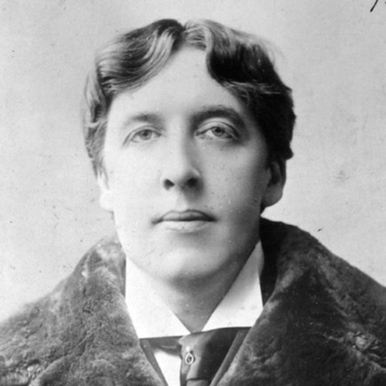</img>
 

## Oscar Wilde
[*The Soul of Man under Socialism*](https://www.marxists.org/reference/archive/wilde-oscar/soul-man/index.htm)
> People find themselves surrounded by hideous poverty, by hideous ugliness, by hideous starvation.  It is inevitable that they should be strongly moved by all this.  *The emotions of man are stirred more quickly than man’s intelligence. It is much more easy to have sympathy with suffering than it is to have sympathy with thought.*  Remedies of these people do not cure the disease: they merely prolong it.  Indeed, their remedies are part of the disease. They try to solve the problem of poverty, for instance, by keeping the poor alive; or, in the case of a very advanced school, *by amusing the poor.*
>  
>  
> But this is not a solution: it is an aggravation of the difficulty. The proper aim is to try and reconstruct society on such a basis that poverty will be impossible. And the altruistic virtues have really prevented the carrying out of this aim. *Just as the worst slave-owners were those who were kind to their slaves,* and so prevented the horror of the system being realised by those who suffered from it, and understood by those who contemplated it, so, in the present state of things in England, the people who do most harm are the people who try to do most good; and at last we have had the spectacle of men who have really studied the problem and know the life – educated men who live in the East End – coming forward and imploring the community to restrain its altruistic impulses of charity, benevolence, and the like. They do so on the ground that such charity degrades and demoralises. They are perfectly right. Charity creates a multitude of sins. 
>  
>  
> There is also this to be said. It is immoral to use private property in order to alleviate the horrible evils that result from the institution of private property. It is both immoral and unfair.

## Frank Zappa
> Without deviation from the norm, progress is not possible.

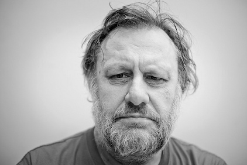</img>
  

## Slavoj Žižek 

See this <a href="https://www.youtube.com/watch?v=hpAMbpQ8J7g">video</a> for a more detailed criticism of the role of charity in modern economies.
  

[*Living in the End Times*](https://www.youtube.com/watch?v=Gw8LPn4irao)
> Charity has a very specific function: the function of depoliticising the problem. The idea is that through charity, capitalism can redeem itself, can be itself the medicine to the evil it causes. 

[*The Freedom of a Forced Choice*](https://www.youtube.com/watch?v=hukgmURSSGQ)
> The notion of freedom, the notion of spontaneous free choice, is not enough. it’s not enough to choose between options given to you. We should also include into the notion of freedom the freedom to influence, to choose the very framework of these choices. 

[*First as tragedy, then as Farce*](https://www.youtube.com/watch?v=hpAMbpQ8J7g)
> When you go to a store, you prefer buying organic apples. Why? Look deep into yourself. I don't think you really believe that those apples which cost double the good old genetically modified apples that we all like, that they are really any better. We are cynics there, we are skeptics. But it makes you feel warm, I'm doing something for our mother earth, I'm doing something for our planet, and so on and so on. 

[*First as tragedy, then as Farce*](https://www.youtube.com/watch?v=hpAMbpQ8J7g)
> You don't just buy a coffee. In the very consumerist act, you buy your redemption from being a consumerist. 

The totality of a system is something to keep in mind when you think about <a href = #pyramid>this</a> observation by Orwell.

[*IQ squared talk*](https://www.youtube.com/watch?v=cW1zUh94uMY)

> When you talk about today's global capitalism, I would say, don't talk only about countries which function more or less like western countries, mention also countries like the democratic republic of Congo, which doesn't even function as a country...the point is to see the republic of Congo not as a simple deviation, that it is not yet capitalism, that this is primitive, but precisely as part of the totality of today's capitalism. 

